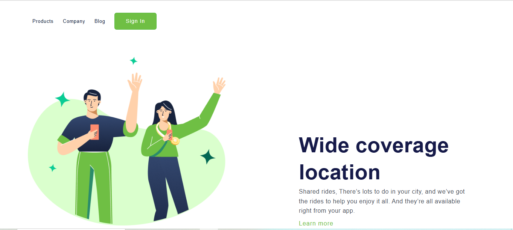

# 🌱 Positive - Página Promocional Responsiva

Projeto de página web simples e elegante, desenvolvido com **HTML5** e **CSS3**, com foco em comunicação de uma mensagem positiva para o usuário. O layout apresenta um visual moderno e leve, ideal para produtos, startups ou campanhas de marketing.

## 📸 Preview



## 🧰 Tecnologias Utilizadas

- HTML5
- CSS3
- Google Fonts (Poppins)

## 🖼️ Layout

- Cabeçalho com links de navegação: `Products`, `Company`, `Blog`, e botão de login (`Sign In`)
- Imagem ilustrativa destacando um benefício do serviço
- Texto promocional com título, descrição e link de chamada para ação

## 💡 Funcionalidades

- Design moderno e responsivo
- Tipografia suave com fonte Poppins
- Botão com destaque em verde (`#6FBF44`)
- Estrutura leve e fácil de adaptar para landing pages

## 📁 Estrutura do Projeto
````
positive-landing/
├── index.html
├── style.css
└── img/
    ├── (Positive) Congratulation You get 40 point for your ride.png
    └── positive-preview.png
````

## 🚀 Como Usar

1. Clone o repositório:
```bash
git clone https://github.com/seu-usuario/positive-landing.git
Abra o arquivo index.html no navegador.
```
Feito com 💚 por **Brenda da Conceição Ramos**